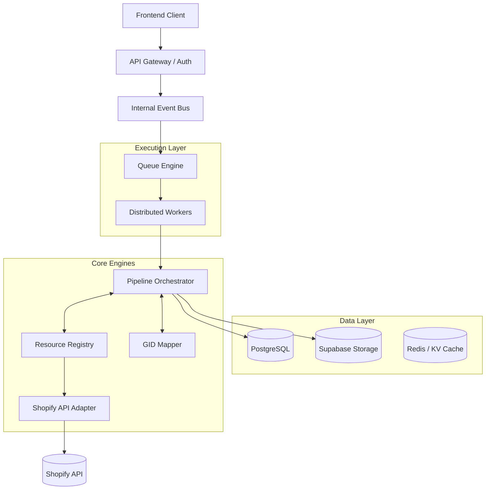
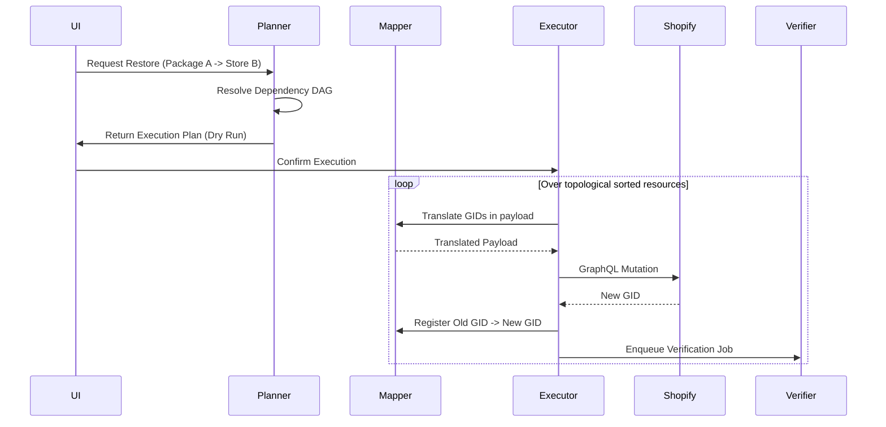

# System Architecture Blueprint
**Imam Recovery OS — Reference Implementation**

This document serves as the master blueprint for transforming Imam Recovery OS into the commercial standard for disaster recovery. It pivots the platform from monolithic backup/restore engines into a modular, event-driven pipeline architecture.

---

## 1. High-Level Architecture

At the highest level, the platform relies on an Event-Driven Architecture (EDA) orchestrated via an Internal Event Bus and a robust Worker Queue.



---

## 2. The Modular Pipeline

We reject the concept of monolithic `startBackup()` and `startRestore()` functions. Instead, operations flow through independent, testable, and replaceable pipeline stages.

### Backup Pipeline


### Restore Pipeline


---

## 3. Core Subsystems

### 3.1 Resource Registry & Plugin Architecture
Instead of hardcoded `if (resource === 'product')` statements, every Shopify entity is a plugin adhering to a strict interface. The engine dynamically loads available plugins.

```typescript
interface ResourcePlugin {
  type: string;                  // e.g., 'product', 'metaobject'
  dependencies: string[];        // e.g., ['collection', 'file']
  
  scan(client: ApiAdapter): Promise<Metadata>;
  export(client: ApiAdapter, stream: Writable): Promise<void>;
  diff(source: Resource, target: Resource): Delta;
  restore(client: ApiAdapter, delta: Delta, mapper: GIDMapper): Promise<string>;
  verify(client: ApiAdapter, resourceId: string): Promise<boolean>;
  rollback(client: ApiAdapter, resourceId: string): Promise<void>;
}
```

### 3.2 Recovery Package v2 Specification
The `.recovery` package is no longer an unstructured dump; it is a strict, portable Operating System Image.

```text
store_2026_07_17.recovery/
├── manifest.json         # Master metadata, scope requirements, generated_at
├── checksums.json        # SHA-256 hashes of every file in the package
├── graph.json            # GID Relationship DAG
├── mapping.json          # Pre-computed mapping for incremental backups
├── metadata/             # Platform analytics, AI insights
├── resources/
│   ├── settings.json
│   ├── products/
│   │   ├── products.jsonl
│   │   └── metafields.jsonl
│   ├── collections/
│   └── customers/
└── media/                # Deduplicated binary assets
    ├── themes/
    │   └── dawn_v12.zip
    └── files/
        ├── sha256_hash_1.jpg
        └── sha256_hash_2.png
```

### 3.3 The GID Mapper (Resource Mapper)
The most critical challenge in restoration is foreign-key mapping. A product belongs to a collection (`gid://123`). In the new store, the collection is created first and gets a new ID (`gid://998`). 

The `GIDMapper` sits between the Pipeline and the Executor.
- When `Executor` creates Collection `123`, Shopify returns `998`. 
- `GIDMapper.set('gid://.../123', 'gid://.../998')`
- When `Executor` creates a Product, it asks the Mapper: `mapper.get('gid://.../123')`, which substitutes `998` into the payload *before* hitting the Shopify API adapter.

### 3.4 Internal Event Bus
Decoupling enables advanced telemetry without bloating core logic. Every pipeline stage emits events to the bus (e.g., Kafka, Redis PubSub, or Postgres Listen/Notify).

- `BackupStarted` -> Updates UI state.
- `ProductExported` -> Triggers metric increment.
- `Throttled` -> Triggers Alerting / AI Insights.
- `VerificationFailed` -> Triggers Repair Pipeline.

### 3.5 AI Recovery Intelligence
Instead of a simple chatbot, the AI is integrated directly into the `Reporter` and `Validator` pipelines. It intercepts `Manifest` data and generates predictive intelligence:
- *Risk Detection:* "You are missing `read_markets` scope. 15% of your catalog will fail to restore."
- *Root Cause Analysis:* "Restore failed on 5 products due to missing Metaobject schemas. Auto-repair suggested."

---

## 4. API Adapter Layer
To insulate the engine from Shopify's quarterly API changes (e.g., `2024-04` to `2024-07`), all external calls pass through versioned Adapters.
- The `Registry` calls `Adapter.getProducts()`.
- The `AdapterFactory` loads the specific implementation for the store's configured API version, normalizing the response into the standard Imam Recovery OS format.

---

## 5. Sequence Diagrams

### Restore Execution Sequence


---

## 6. Scaling Strategy (Millions of Records)

To support massive enterprise merchants (5M+ orders, 500K+ products) without memory exhaustion:
1. **No In-Memory Accumulation:** All exporters and archivers use `Node.js Streams` (or Web Streams).
2. **Shopify Bulk Operations:** Exporters do not paginate heavily; they trigger Shopify Bulk Operations, download the JSONL, and stream it directly into the Archiver.
3. **Cursor-Based Chunking:** Importers (Executors) process JSONL files in controlled chunks (e.g., 250 items), maintaining a cursor in the DB to allow instantaneous resumption if the worker is killed.
4. **Horizontal Worker Scaling:** The Event Bus distributes chunks to multiple parallel workers. E.g., 10 workers process the `customers.jsonl` simultaneously, syncing IDs back to the centralized Redis/Postgres Mapper.

---

## 7. Disaster Recovery Strategy for Imam Recovery OS

A disaster recovery platform must be resilient itself.
- **Cross-Region Replication:** Postgres database and Supabase Storage buckets must be configured for multi-region replication.
- **KMS Secret Rotation:** Encrypted Shopify tokens rely on keys that can be safely rotated without losing access.
- **Immutable Audit Logs:** All user and system actions are written to append-only logs stored separately from the main transactional DB, enabling forensic analysis if the Imam Recovery OS is compromised.

> [!IMPORTANT]
> **Developer Approval Required:** This blueprint defines the architectural standard moving forward. Implementing this requires abandoning tactical "feature building" in favor of systematic framework construction (specifically: building the Registry interface, GID Mapper, and Event Bus first). Do I have your approval to establish this as our definitive architecture?
